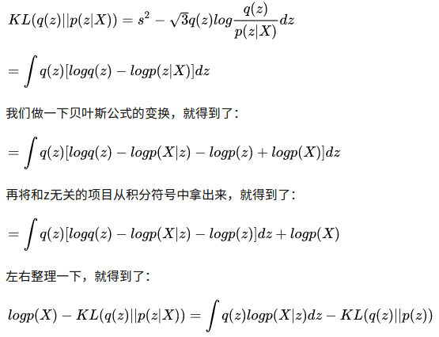

# VAE
	by zhangxin
> #### 关于VAE与GAN中的隐变量
>> - 通常来说，我们认为图像，文字，音频等等数据是分布在低维流形空间上的。 在像GAN和VAE这样子的生成模型来说，如果隐变量选择的空间维数太低，那么就一定不可能还原或者说生成接近真实样本的图像。
>> - 参考值，mnist数据空间上，内在维数(i.e. 最低的隐变量维数)是6.5 。
>> - 设置隐变量维数(hyperparameter)，就是在设置我们主观认定的该数据集的内在维数(不能太低).

> #### autoencoder 与 VAE
>> - autoencoder : encoder进行编码，得到编码z，直接将z进行解码得到图像。
>> - vae : autoencoder直接对encoder得到的编码z进行解码，只能得到信息有损失的原图像，并不能生成新的图像.因此autoencoder不能被称作是生成模型，在autoencoder中缺乏了随机性因素。
>> - variational autoencoder，在encoder的过程中，增加一些限制，迫使其生成的隐含向量能够粗略的遵循一个标准正态分布。 然后生成器只需要在标准正态分布中抽样，即可。

> #### VAE_loss
>> - VAE的loss分为两部分，重构误差(看最终输出的图片的效果怎么样) + 引向量空间与目标空间的KL散度(看编码的怎么样)
   
 
  VAE_loss公式推导
>> - optimizer的目标是使上述等式右侧第一项最大化:对应调整decoder，也就是重构误差， 按照VAE公式来说，重构误差应该使用交叉熵的形式。 
  第二项KL散度最小化:对应调整encoder ， encoder的编码要尽量接近正态分布。

