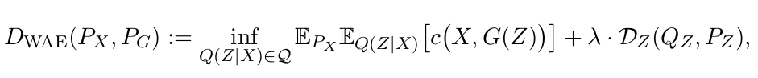
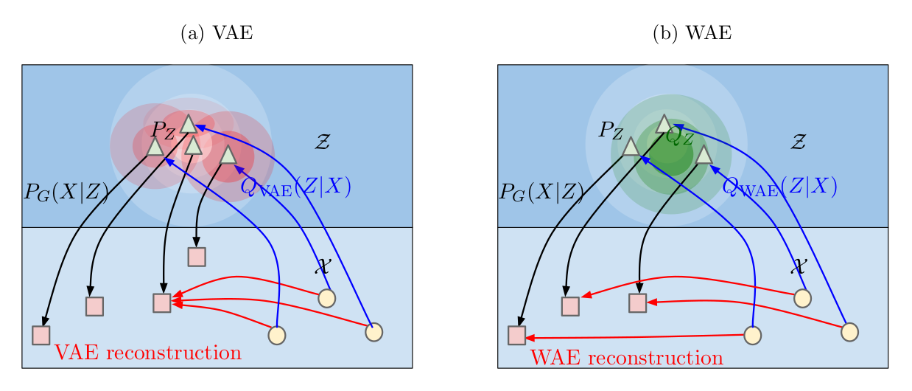
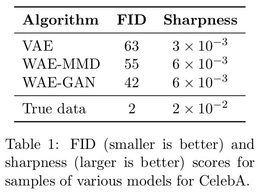

# WAE
	by zhangxin
#### VAE->WAE
> - VAE的loss分为两部分，重构误差以及隐空间误差  其中重构误差是交叉熵的形式。  隐空间差距度量是KL散度的形式。
> - VAE的loss存在的问题   KL散度存在的问题是与GAN -> WGAN 中的KL散度的问题是一致的 ： KL散度作为loss会导致梯度消失。
> - WAE的贡献：
>> 
>> + 使用w距离来作为重构误差，而不是使用交叉熵。即：最简单的就是对应像素点之间的欧氏距离(均方误差)最小。
>> + 隐空间差距度量方式：不再使用KL散度来作为度量方式，作者将隐空间差距度量看做是一种正则化的方式。作者提出了两种正则方法：MMD & GAN 。
>> + WAE完美的保留了VAE所有的好的特性，并且在WAE的基础上还有提升。

#### why WAE performs better

> - 在VAE中，encoder对于每一个输入的图片编码成隐向量，VAE迫使每一个隐向量(a图红圈)去逼近目标的标准正态分布(a图白圈)。 但是在WAE中，并不是**迫使每一个真实的样本编码成的隐向量去逼近标准正态分布**，而是让整个连续的编码后的分布去逼近标准正态分布。

#### 启示与对比 
> GAN中，discriminator可以看做是一个随着生成器的不断训练而在不断变强的一个正则因子 

